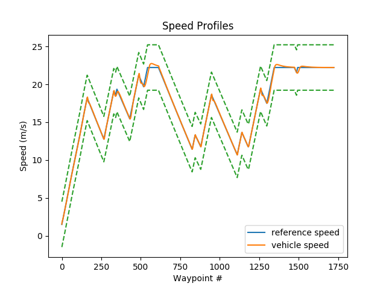

# Longitudinal and Lateral Control of a Vehicle
In this section, we use Carla simulator to implement a controller that controls a vehicle to follow a race track by navigating through a preset waypoints. Both longitudinal and lateral control are used in this simulation as the vehicle needs to arrive to the reference points at specific speeds. To understand how these controllers are implemented, I would highly recommand you to study the lateral control methodology from [here](https://www.ri.cmu.edu/pub_files/2009/2/Automatic_Steering_Methods_for_Autonomous_Automobile_Path_Tracking.pdf) and also longitudinal control methodologies from this [article](http://ieeexplore.ieee.org/stamp/stamp.jsp?tp=&arnumber=8286943&isnumber=8363076) and this [one](http://homepage.divms.uiowa.edu/~kearney/pubs/CurvesAndSurfaces_ClosestPoint.pdf).

## Carla Simulator
Carla simulator is one of the open-source simulators that is used for testing self-driving implementations. You can learn more about it [here](https://carla.org/). The code here only works on python 3.5 or 3.6 versions as the main simulator is developed on these python versions.

## Vehicle Control Logics
The main longitudinal and lateral control logics are implemented inside `controller2d.py` file and the related `Controller2D` python class. The main idea of this simulation is to implement a model that can follow the reference points and the related speeds provided in the `racetrack_waypoints.txt` file. 

### Vehicle Variables and Controller Inputs
The vehicle location, $X,Y$ in meters, vehicle orientation, $yaw$ in radians, vehicle speed, $v$ in m/s, game time, $t$ in seconds, desired speed, $v_desired$ in m/s, and waypoints to track, $waypoints$, are the important variables used for designing the controller.

The variables that specify throttle, steering, and brake status are named by $throttle_output$, $steer_output$, and $brake_output$ respectively.

The desired speed is set to the closest interpolated speed point to the current position of the car. The speeds are in meters per second and the throttle (0 to 1), brake (0 to 1) and steering (-1 to 1, or left to right turn) are unitless. Note that the steering command output inside `controller2d.py`` is automatically converted from radians (-1.22 to 1.22 rad) to a percentage (-1 to 1) before the command is sent to the Carla server.

### Longitudinal PID Controller

  

We use a PID controller to control the speed of the vehicle as is shown in the following image. The desired velocities are collected from the reference file while the actual velocity is collected from the vehicle in the simulation. 

To calculate the proportional, integral and derivatve parts of the controller, we need to calculate the difference between previous and current timestamp, the difference between previous and current velocity and also sum of  velocities errors till now. The $K_P=1.5$, $K_I=0.7$, and $K_D=0.4$ are selected in such a way that the vehicle tracks the desired velocity at each waypoint.

### Lateral Stanely Controller

We use Stanely for lateral control of our vehicle. In this regard, the heading error and the cross track error shall be calculated and sumed up to form the appropriate steering for the vehicle. 

Heading error is the difference between the angle of the path and also the angle of the car as is shown in the following figure.

Cross track error is the distance between the current location of the vehicle and the trajectory line. In order to calculate this distance we calculate the Euclidean distance between all waypoint and the current location of the car and select the smallest one as the cross track error. It is good to mention that the sign of cross track error shall be the specified based on whether the vehicle has passedi t or not and can be decided based on the angle of the vehicle calulated from heading error.

The final steering value can be calculated using the following Stanely equation considering the constant $K_e=0.3$

  

## How to Run
To run the code, download this code into the `PythonClient` directory in the Carla simulator root folder. 
By running the `./CarlaUE4.sh /Game/Maps/RaceTrack -windowed -carla-server -benchmark -fps=30` you can run the Carla in server mode with 30 frame per second and the race track area. 

To run your controller, you should run `main.py` file alongside of Carla in a new terminal window. If the `live_plotting` parameter in `option.cfg` is enabled then you can monitor the trajectory and control feedbacks of your simulation online in two separate windows. 

The trajectory feedback will contain the car, start and end positions, entire path/path traveled and a small shaded region which denotes the subset of interpolated points to be sent into the controller for control updates.
The controls feedback shows the throttle, steering and brake outputs, as well as the speed response for the simulation (desired speed and current speed in the single plot). This is a general feedback for viewing what the client is sending to the Carla server in terms of control commands. 

If the simulation runs slowly, you can try increasing the period at which the live plotter refreshes the plots, or disabling the live plotting altogether. Disabling the live plotting does not affect the plot outputs at the end of the simulation.

## Results
The results of our simulation is shown in the following images as you can see the reference track and the traveled one in addition to the throttle, brake, and steer inputs of the vehicle in addition to the forward speed.

    
     
     
    

In this images, you can see the reference and traveled trajectories in order to find out about the accuracy of the lateral controller as well as the accuracy of the longitudinal controller. The simulation video is also added here.

    

     
     

<video align="center" width="500" height="350" controls>
  <source src="./images/results.mp4" type="video/mp4">
</video>

