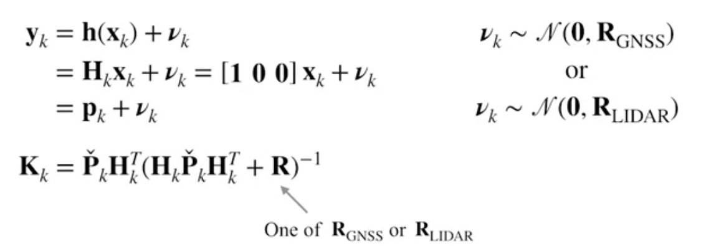

# Error State Estimation with Extended Kalman Filter
In this part, we will implement the Error-State Extended Kalman Filter (ES-EKF) to localize a vehicle using data from the CARLA simulator. 

## Vehicle States and Motion Model Inputs
The vehicle state at each time step consists of position, velocity, and orientation, parametrized by a unit quaternion. We can write these states as $\bold{x}_k=\begin{bmatrix}\bold{p}_k\\ \bold{v}_k\\\bold{q}_k\end{bmatrix}\in \mathbb{R}^{10}$.
The inputs to the motion models are the IMU specific force and angular rate measurements. We can write these inputs as $\bold{u}_k=\begin{bmatrix}\bold{f}_k\\ \bold{\omega}_k\end{bmatrix}\in \mathbb{R}^{6}$. You can find the main idea in the following model overview.

    

All the position, quaternion, and velocity vectors have the length of the IMU data in the sample data file while we have three dimensional position, three dimensional velocity and four dimensional quaternion. The covariance matrix at each step has also 9 by 9 shape. We initialize the estimated pose and velocity to be the values of the ground truth at the start of the trajectory. We also set the covariance of the position to be zero as the exact pose is exact.

## Prediction Step using IMU Data in EKF
In the main loop of the EKF, you can see loop over each state of the IMU data and propagating the state estimate forward in time. We use the following equations to calculated the related position, velocity and quaternion estimates. Note that the solution takes a specific force and angular rotation rate measurement from IMU as inputs and outputs an updated estimate that is the position and velocity of the vehicle. We make use of the position an velocity estimate the previous time step to predict our current state.  

    

## Error State Linearization in EKF
Till now we propagate the the nomianl state, that is the prediction forward in time. However, the nominal state ignores noise and perturbations. The error state extended kalman filter capture these deviations in the error state vector which incorporates a minimal three parameter orientation error. In this step, we linearize dynamic error of the system according to the following equations. 

    

## Uncertainty Propagation in EKF
Next we propagate the state uncertainty forward in time. We use the jacobian matrix for this purpose.

    

## Measurement Availability and Update in EKF
After completing the the prediction step wihtin a filter, we check to determine if a GNSS receiver or LIDAR measurement is available. If we have a measurment from either of these sensors, we update our measurements which is the correction step in the overview. Please keep in mind that the IMU update rate is higher than the LIDAR or GNSS update rates.
To update the measurement, we use the following equations with a function.

    
    

## Run the Code and Results
To run the code, simply run `python es_ekf.py`.
The results can be found here.

    
    

