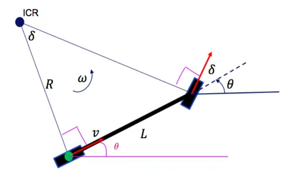
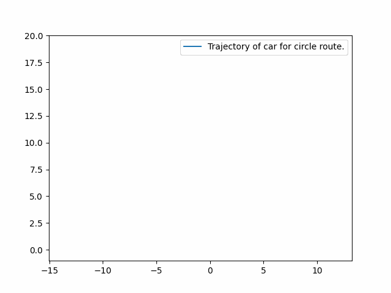
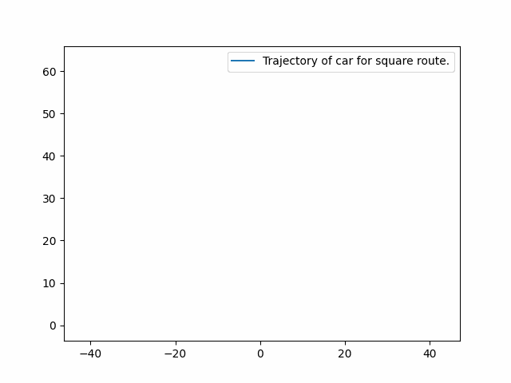
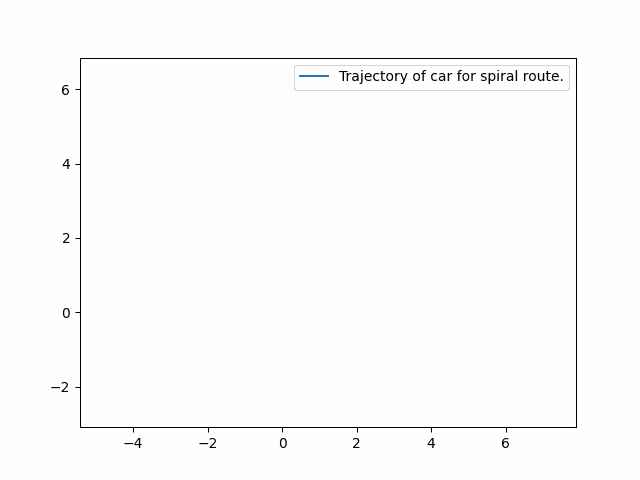
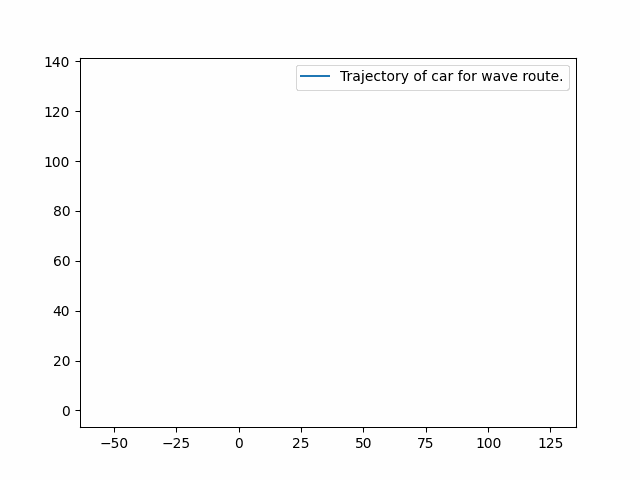
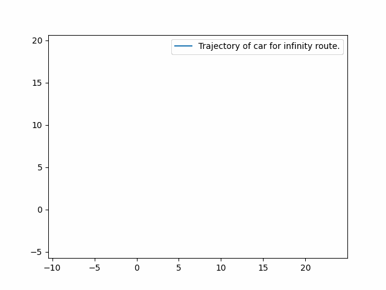

# Vehicle Kinematic/Dynamic Modeling

The first step in the field of autonomous driving is understanding of kinematic and dynamic modelings of cars.

Kinematic modeling is the process of modeling of a car considering geometric constraints that defines its motions. In the kinemtaic modeling the effects of forces would be neglected. It is good to mention that kinematic modeling has good accuracy in low speeds. 

Dynamic modeling on the other hand, considers the effects of forces and moments on the vehicle and estimates the vehicle motion thoroughout the vehicles operating range based on the newton third rule.

## Kinematic Model of a Vehicle

If you consider a car as a a simple two-wheeled vehicle like a bicycle, then the kinematic model of the car can be described with following equations:

  

$$\begin{align*}
\dot{x}_c &= v \cos{(\theta + \beta)} \\
\dot{y}_c &= v \sin{(\theta + \beta)} \\
\dot{\theta} &= \frac{v \cos{\beta} \tan{\delta}}{L} \\
\dot{\delta} &= \omega \\
\beta &= \tan^{-1}(\frac{l_r \tan{\delta}}{L})
\end{align*}$$

where the inputs are the steering angle rate $\omega$ and the vehicle velocity $v$. State variables are the $\theta$ as the heading angle, $\delta$ is steering angle, and $x_c$ and $y_c$ are the movements of the gravity center of the car in the related $XY$ directions.

You can find more information regarding how these equations are derived from this [link](https://dingyan89.medium.com/simple-understanding-of-kinematic-bicycle-model-81cac6420357) or this [video](https://www.youtube.com/watch?v=D4AgX1zjx54).

### Kinematic Model Simulation

The car kinematic model is defined in `kinematic_model.py` and in the class `Car`. The `Trajectory` class contains methods for traveing in different types of trajectories such as circle, spiral, wave, square and infinity routes. By running the related code, you would understand how kinematic model of a car works in different situations. The results are shown as following:

    
     
     

    
     

## Dynamic Longitudinal Vehicle Model

The dynamic modeling analyzes the effects of forces on the vehicle. Longitudinal modeling gets the throttle inputs from the vehicle as the throttle percentage $x_{\theta}\in[0,1]$ which provides torque to the engine and subsequently accelerates the vehicle in the longitudinal direction. It is good to mention that the throttle inputs transfer energy from the engine to the torque converter, then to transmission equipment, and finally to the wheels. By using the third rule of newton, these stages can be bundled together in a single inertia term in the following equations:

$$\begin{align*}
J_e \dot{\omega_e} = T_e - (GR)(r_{eff} F_{load}) \\
m\ddot{x} = F_x - F_{load}
\end{align*}$$

where $J_e$ is the bundled inertia, $T_e$ is the engine torque, $GR$ is the gear ratio, $r_{eff}$ is the effective tire radius, $m$ is the vehicle mass, $x$ is the vehicle position, $F_x$ is the tire force, and $F_{load}$ is the total load force.  

The engine torque is computed from the throttle input and the engine angular velocity $\omega_e$ using a simplified quadratic model. 

$$\begin{align*}
T_e = x_{\theta}(a_0 + a_1 \omega_e + a_2 \omega_e^2)
\end{align*}$$

The load forces consist of aerodynamic drag $F_{aero}$, rolling friction $R_x$, and gravitational force $F_g$ from an incline at angle $\alpha$. The aerodynamic drag is a quadratic model and the friction is a linear model.

$$\begin{align*}
F_{load} = F_{aero} + R_x + F_g \\
F_{aero} = \frac{1}{2} C_a \rho A \dot{x}^2 = c_a \dot{x}^2 \\
R_x = N(\hat{c_{r,0}})
\end{align*}$$

Note that the absolute value is ignored for friction since the model is used for only forward motion ($\dot{x} \ge 0$). 
 
The tire force is computed using the engine speed and wheel slip equations.

$$\begin{align*}
\omega_w &= (GR)\omega_e \\
s &= \frac{\omega_w r_e - \dot{x}}{\dot{x}}\\
F_x &= \{\begin{array}{lr}
cs, &  |s| < 1\\
F_{max}, & \text{otherwise}
\end{array}\} 
\end{align*}$$

Where $\omega_w$ is the wheel angular velocity and $s$ is the slip ratio. 

