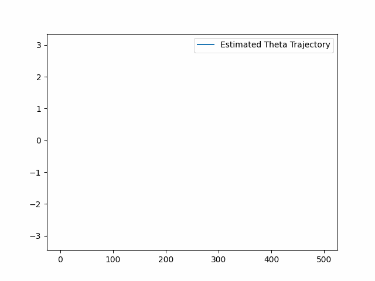
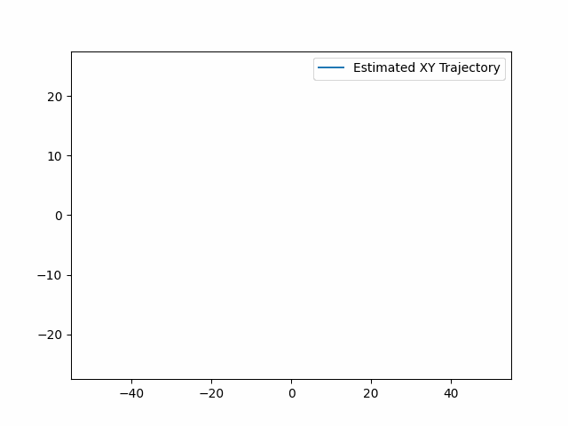

# Vehicle Position Estimation with Extended Kalman Filter (EKF)
In this section, we try to estimate the position of vehicle along a trajectory based on the motion model and the available measurements using Extended Kalman filter as state estimator since the model equations are nonlinear.
The measurements are collected with a LIDAR sensor showing the landmarks in the environment nd also the bearing measurements. 

## Motion Model
The motion model allows us to use Kalman filter. To do so, we assume that the vehicle gets linear and angular velocity as inputs and outputs the 2D position of the vehicle. This model can written as following:

$$\begin{align}
\mathbf{x_k} = \mathbf{x_{k-1}} + T
\begin{bmatrix}
\cos\theta_{k-1} &0 \\
\sin\theta_{k-1} &0 \\
0 &1
\end{bmatrix}
\left(
\begin{bmatrix}
v_k \\
\omega_k
\end{bmatrix} + \mathbf{w}_k
\right)
\, \mathbf{w}_k = \mathcal{N}\left(\mathbf{0}, \mathbf{Q}\right)
\end{align}$$

where $\mathbf{x}_k = \left[ x \, y \, \theta \right]^T$ is the current state vector representing the current position of the vehicle, $v_k$ and $\omega_k$ are linear and angular velocity inputs, and $\mathbf{w}_k$ is the process noise with zero mean and covariance matrix of $Q$.

## Measurement Model

The measurement model relates the current pose of the vehicle to the LIDAR range and bearing measurements $\mathbf{y}^l_k = \left[r \, \phi \right]^T$.

$$\begin{align}
\mathbf{y}^l_k =
\begin{bmatrix}
\sqrt{(x_l - x_k - d\cos\theta_{k})^2 + (y_l - y_k - d\sin\theta_{k})^2} \\
arctan\left((y_l - y_k - d\sin\theta_{k})/(x_l - x_k - d\cos\theta_{k})\right) - \theta_k
\end{bmatrix}
+
\mathbf{n}^l_k
\, \mathbf{n}^l_k = \mathcal{N}\left(\mathbf{0}, \mathbf{R}\right)
\end{align}$$

where $x_l$ and $y_l$ are the ground truth coordinates of the landmark $l$, $x_k$ and $y_k$ and $\theta_{k}$ are the current pose of the vehicle, $d$ is the known distance between robot center and LIDAR laser rangefinder.
The landmark measurement noise $\mathbf{n}^l_k$ has a normal distribution with zero mean and a constant covariance $\mathbf{R}$.

## Methodology Description
We use extended kalman filter for pose estimation of the vehicle as it tries to linearize the model at a specific working point while applying the prediction step to produce a state and a correction step to correct the pose estimates. In other words, in the prediction step, we use motion model and the inputs to find the current state of the vehicle considering the process noise with a constant variance. In the correction step, we use a LIDAR and bearing measurements to correc the state estimatins considering the measurement noise with a constant covariance matrix. 

### Correction Step in EKF
We tend to implement the measurement update function, which takes an available landmark measurement $l$ and updates the current state estimate $\mathbf{\check{x}}_k$.
For each landmark measurement received at a given timestep $k$, one should implement the following steps:

 1. Compute the measurement model Jacobians at $\mathbf{\check{x_{k}}}$

$$\begin{align}
\mathbf{y^{l_k}} = &\mathbf{h}(\mathbf{x_{k}}, \mathbf{n^{l_k}}) \\\\
\mathbf{H_{k}} = \frac{\partial \mathbf{h}}{\partial \mathbf{x_{k}}}& \,
\mathbf{M_{k}} = \frac{\partial \mathbf{h}}{\partial \mathbf{n_{k}}}.
\end{align}$$

 2. Compute the Kalman Gain

$$\begin{align}
\mathbf{K}_k &= \mathbf{\check{P}}_k \mathbf{H}_k^T \left(\mathbf{H}_k \mathbf{\check{P}}_k \mathbf{H}_k^T + \mathbf{M}_k \mathbf{R}_k \mathbf{M}_k^T \right)^{-1} 
\end{align}$$

 3. Correct the predicted state

$$\begin{align}
\mathbf{\check{y}}^l_k &= \mathbf{h}\left(\mathbf{\check{x}}_k, \mathbf{0}\right) \\
\mathbf{\hat{x}}_k &= \mathbf{\check{x}}_k + \mathbf{K}_k \left(\mathbf{y}^l_k - \mathbf{\check{y}}^l_k\right)
\end{align}$$

 4. Correct the covariance

$$\begin{align}
\mathbf{\hat{P}}_k &= \left(\mathbf{I} - \mathbf{K}_k \mathbf{H}_k \right)\mathbf{\check{P}}_k
\end{align}$$

The correction step is defined in the `correction_step()` method of the `PoseEstimator` class in the `ekf.py` file.

### Prediction Step in EKF
To implement the prediction step, we should implement the following equations based on the motion model defined above:

$$\begin{align}
\mathbf{\check{x_k}} &= \mathbf{f}\left(\mathbf{\hat{x_{k-1}}}, \mathbf{u_{k-1}}, \mathbf{0} \right) \\
\mathbf{\check{P_k}} &= \mathbf{F_{k-1}}\mathbf{\hat{P_{k-1}}}\mathbf{F_{k-1}}^T + \mathbf{L_{k-1}}\mathbf{Q_{k-1}}\mathbf{L_{k-1}}^T .
\end{align}$$

Where

$$\begin{align}
\mathbf{F_{k-1}} = \frac{\partial \mathbf{f}}{\partial \mathbf{x_{k-1}}}  \,
\mathbf{L_{k-1}} = \frac{\partial \mathbf{f}}{\partial \mathbf{w_{k}}}.
\end{align}$$

The prediction step is defined in the `prediction_step()` method of the `PoseEstimator` class in the `ekf.py` file.

## How to Run
To run the code, one should run the `ekf.py` file which will automatically read the data file and save the results in the `image` directory.

## Results
By running the aobve estimator, one can find the exact position of the vehicle at each time stamp. The following images shows how the Kalman filter estimates the vehicle state at each timestamp using the LIDAR measurement range.

    
     

